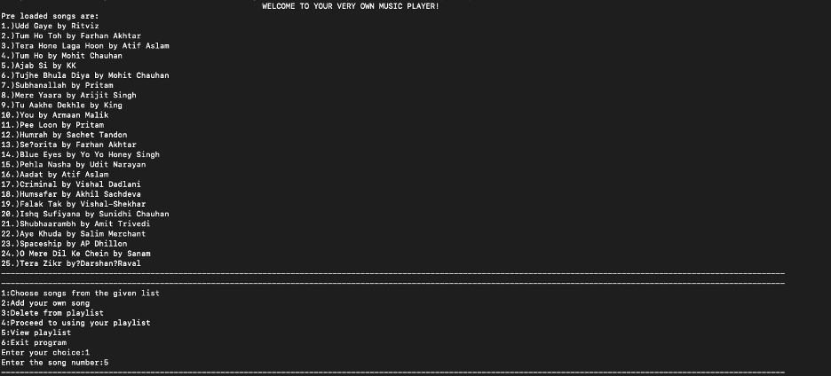

# Playlist Simulation: Data Structures Project

## Department of Data Science and Engineering  
Manipal Institute of Technology  

## Table of Contents

- [Objective](#objective)
- [Methodology](#methodology)
  - [Workflow](#workflow)
  - [Data Structures Used](#data-structures-used)
- [Advantages of Data Structures Used](#advantages-of-data-structures-used)
- [Results Obtained](#results-obtained)
  - [Insertion from Given List to Playlist](#insertion-from-given-list-to-playlist)
  - [Printing the Playlist](#printing-the-playlist)
  - [Using the Playlist](#using-the-playlist)
  - [Creating and Managing Playing Order](#creating-and-managing-playing-order)
- [My Contribution](#my-contribution)
- [Conclusion](#conclusion)
- [Project Status](#project-status)
- [License](#license)

---

## Objective

This project aims to **simulate the working of a playlist** using **data structures**.  

✅ Users can **add and delete** songs from their playlist.  
✅ Users can **decide the order** in which songs should be played.  
✅ The project uses **arrays and doubly circular linked lists** to efficiently store and manipulate playlists.  

---

## Methodology

### Workflow

1️⃣ **Display Songs List**:  
   - At the start, a **list of 25 predefined songs** is displayed using an **array**.  
   - Users can **add songs** from this list or **insert their own songs** into the playlist.  

2️⃣ **Playlist Management**:  
   - Users can **edit the playlist at any time** (add/remove/view songs).  
   - Once satisfied, they can proceed to **play the music**.  

3️⃣ **Playing Music**:  
   - Users can choose to **play the entire playlist** or **define a custom playing order**.  
   - The user can **pause/play songs** and move **next/previous** using a menu.  

**📷 Workflow Diagram**  
  

---

### Data Structures Used

1️⃣ **Array**  
   - Stores **25 predefined songs** that users can choose from.  
   - Simple and **space-efficient** since it does not require dynamic memory allocation.  

2️⃣ **Doubly Circular Linked List (Playlist)**  
   - Used to **store the user’s playlist** dynamically.  
   - Allows **insertion, deletion, and traversal** in both forward and backward directions.  
   - Being **circular**, the playlist never stops—after the last song, it loops back to the first.  

3️⃣ **Doubly Circular Linked List (Playing Order)**  
   - If a user wants a **custom playing order**, another linked list is created.  
   - The **existing playlist songs** are rearranged based on user preference.  

---

## Advantages of Data Structures Used

✅ **Array**  
   - Space-efficient for **fixed-size** song lists.  
   - Fast **random access** to songs.  

✅ **Doubly Circular Linked List**  
   - **Dynamic memory allocation** saves space by allocating memory as needed.  
   - Users can **add unlimited songs** without wasteful memory allocation.  
   - The **circular structure** ensures continuous music playback.  

---

## Results Obtained  

### Insertion from Given List to Playlist  
Users can **add** predefined songs to their playlist.  

**📷 Insertion Example**  
  

### Printing the Playlist  
Users can view the current playlist at any time.  

**📷 Playlist Output Example**  
  

### Using the Playlist  
Users can:  
✔ Play the playlist **from start to finish**.  
✔ Pause, **skip forward/backward** between songs.  
✔ Edit the playlist anytime.  

**📷 Playlist Functions**  
  

### Creating and Managing Playing Order  
Users can define a **custom playing order** and play songs accordingly.  

**📷 Playing Order Functions**  
  

---

## My Contribution  

🔹 Implemented the function to **search for a song** in the playlist and **add it to a custom playing order**.  
🔹 Wrote the code to **create and manage a new playing order** defined by the user.  
🔹 Created the **PowerPoint presentation** for the project.  

---

## Conclusion  

Through this project, I learned:  
✅ **The importance of data structures** in handling real-world applications.  
✅ **The simplicity and efficiency of arrays** for fixed-size operations.  
✅ **The advantages of dynamic memory allocation** using doubly circular linked lists.  

---

## Project Status  
This project is **completed** as part of the **Data Structures Lab** at **Manipal Institute of Technology**.  

---

## License  
This project is licensed under the [MIT LICENSE](LICENSE).  
